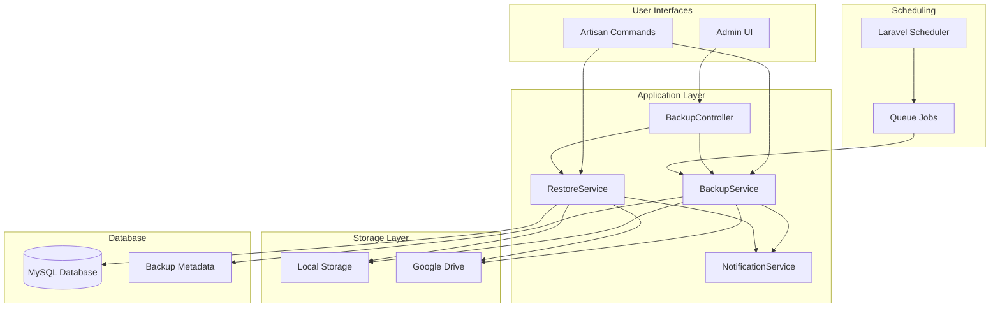
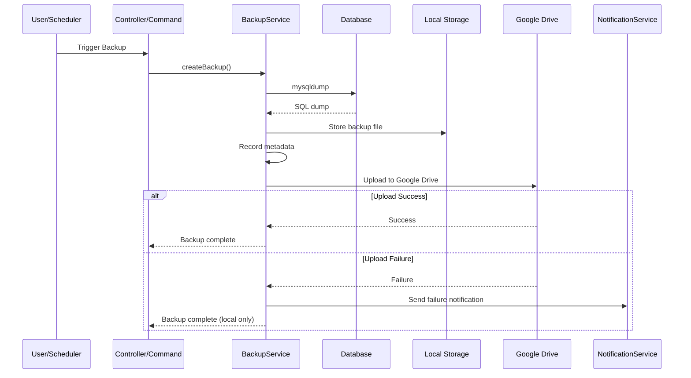

# Design Document: Database Backup Feature

## Overview

The Database Backup feature provides comprehensive backup and restore capabilities for the HMS database. It supports both scheduled and on-demand backups, stores backups locally and on Google Drive, and includes configurable retention policies with failure notifications. The feature integrates with the existing HMS permission system and provides both UI and CLI interfaces.

## Architecture

### High-Level Architecture



### Component Interaction Flow



## Components and Interfaces

### 1. Models

#### Backup Model
```php
class Backup extends Model
{
    protected $fillable = [
        'filename',
        'file_size',
        'file_path',
        'google_drive_file_id',
        'status',           // pending, completed, failed
        'source',           // manual_ui, manual_cli, scheduled
        'is_protected',
        'created_by',
        'completed_at',
        'error_message',
    ];
    
    protected $casts = [
        'file_size' => 'integer',
        'is_protected' => 'boolean',
        'completed_at' => 'datetime',
    ];
    
    public function creator(): BelongsTo;
    public function scopeCompleted(Builder $query): Builder;
    public function scopeUnprotected(Builder $query): Builder;
    public function isOnGoogleDrive(): bool;
    public function isLocal(): bool;
}
```

#### BackupSettings Model
```php
class BackupSettings extends Model
{
    protected $fillable = [
        'schedule_enabled',
        'schedule_frequency',    // daily, weekly, custom
        'schedule_time',
        'cron_expression',
        'retention_daily',
        'retention_weekly', 
        'retention_monthly',
        'google_drive_enabled',
        'google_drive_folder_id',
        'notification_emails',
    ];
    
    protected $casts = [
        'schedule_enabled' => 'boolean',
        'google_drive_enabled' => 'boolean',
        'notification_emails' => 'array',
        'retention_daily' => 'integer',
        'retention_weekly' => 'integer',
        'retention_monthly' => 'integer',
    ];
}
```

### 2. Services

#### BackupService
```php
class BackupService
{
    public function createBackup(string $source, ?User $user = null): Backup;
    public function deleteBackup(Backup $backup): bool;
    public function downloadBackup(Backup $backup): StreamedResponse;
    public function getBackupFilePath(Backup $backup): string;
    protected function executeDatabaseDump(): string;
    protected function uploadToGoogleDrive(string $filePath): ?string;
    protected function recordBackupMetadata(array $data): Backup;
}
```

#### RestoreService
```php
class RestoreService
{
    public function restore(Backup $backup, ?User $user = null): bool;
    public function createPreRestoreBackup(): Backup;
    protected function downloadFromGoogleDrive(Backup $backup): string;
    protected function executeRestore(string $filePath): bool;
}
```

#### GoogleDriveService
```php
class GoogleDriveService
{
    public function isConfigured(): bool;
    public function testConnection(): bool;
    public function upload(string $filePath, string $filename): ?string;
    public function download(string $fileId): string;
    public function delete(string $fileId): bool;
}
```

#### BackupNotificationService
```php
class BackupNotificationService
{
    public function notifyBackupFailure(Backup $backup, string $error): void;
    public function notifyRestoreFailure(Backup $backup, string $error): void;
    public function notifyScheduledBackupFailure(string $error): void;
}
```

#### RetentionService
```php
class RetentionService
{
    public function applyRetentionPolicy(): int;
    protected function getBackupsToDelete(): Collection;
    protected function categorizeBackups(): array;
}
```

### 3. Controllers

#### BackupController
```php
class BackupController extends Controller
{
    public function index(): Response;           // List backups
    public function store(): RedirectResponse;   // Create backup
    public function show(Backup $backup): Response;
    public function destroy(Backup $backup): RedirectResponse;
    public function download(Backup $backup): StreamedResponse;
    public function restore(Backup $backup): RedirectResponse;
}
```

#### BackupSettingsController
```php
class BackupSettingsController extends Controller
{
    public function edit(): Response;
    public function update(UpdateBackupSettingsRequest $request): RedirectResponse;
    public function testGoogleDrive(): JsonResponse;
}
```

### 4. Artisan Commands

#### backup:create
```php
class CreateBackupCommand extends Command
{
    protected $signature = 'backup:create {--source=cli}';
    protected $description = 'Create a database backup';
}
```

#### backup:restore
```php
class RestoreBackupCommand extends Command
{
    protected $signature = 'backup:restore {backup} {--force}';
    protected $description = 'Restore database from a backup';
}
```

#### backup:cleanup
```php
class CleanupBackupsCommand extends Command
{
    protected $signature = 'backup:cleanup';
    protected $description = 'Apply retention policy and cleanup old backups';
}
```

### 5. Jobs

#### CreateBackupJob
```php
class CreateBackupJob implements ShouldQueue
{
    public int $tries = 3;
    public int $backoff = 60;
    
    public function handle(BackupService $service): void;
    public function failed(Throwable $exception): void;
}
```

### 6. Policies

#### BackupPolicy
```php
class BackupPolicy
{
    public function viewAny(User $user): bool;      // backups.view
    public function view(User $user, Backup $backup): bool;
    public function create(User $user): bool;        // backups.create
    public function delete(User $user, Backup $backup): bool;  // backups.delete
    public function restore(User $user, Backup $backup): bool; // backups.restore
    public function manageSettings(User $user): bool;          // backups.manage-settings
}
```

## Data Models

### Database Schema

```mermaid
erDiagram
    backups {
        bigint id PK
        string filename
        bigint file_size
        string file_path
        string google_drive_file_id
        enum status
        enum source
        boolean is_protected
        bigint created_by FK
        timestamp completed_at
        text error_message
        timestamps
    }
    
    backup_settings {
        bigint id PK
        boolean schedule_enabled
        enum schedule_frequency
        time schedule_time
        string cron_expression
        int retention_daily
        int retention_weekly
        int retention_monthly
        boolean google_drive_enabled
        string google_drive_folder_id
        json notification_emails
        text google_credentials
        timestamps
    }
    
    backup_logs {
        bigint id PK
        bigint backup_id FK
        bigint user_id FK
        enum action
        text details
        timestamps
    }
    
    users ||--o{ backups : creates
    backups ||--o{ backup_logs : has
    users ||--o{ backup_logs : performs
```

### Backup Filename Convention

Format: `hms_backup_{YYYYMMDD}_{HHMMSS}.sql.gz`

Example: `hms_backup_20250607_143022.sql.gz`

### Storage Paths

- Local: `storage/app/backups/`
- Google Drive: Configurable folder ID

## Error Handling

### Backup Failures

1. **Database dump failure**: Log error, mark backup as failed, send notification
2. **Local storage failure**: Log error, mark backup as failed, send notification
3. **Google Drive upload failure**: Log warning, keep local backup, mark as partial success
4. **Scheduled backup failure**: Retry up to 3 times with 60-second backoff, then send notification

### Restore Failures

1. **Pre-restore backup failure**: Abort restore, notify user
2. **Download from Google Drive failure**: Abort restore, send notification
3. **Database restore failure**: Attempt to restore pre-restore backup, send notification

## Testing Strategy

### Unit Tests

- BackupService: Test backup creation, metadata recording, file handling
- RestoreService: Test restore logic, pre-restore backup creation
- RetentionService: Test retention policy calculations
- GoogleDriveService: Test upload/download/delete operations (mocked)

### Feature Tests

- BackupController: Test all CRUD operations with authorization
- BackupSettingsController: Test settings management
- Artisan commands: Test CLI backup and restore operations

### Property-Based Tests

Property-based tests will verify universal properties across all inputs using a PBT library (e.g., QuickCheck-style for PHP or custom generators).


## Correctness Properties

*A property is a characteristic or behavior that should hold true across all valid executions of a system-essentially, a formal statement about what the system should do. Properties serve as the bridge between human-readable specifications and machine-verifiable correctness guarantees.*

Based on the acceptance criteria analysis, the following correctness properties must be verified through property-based testing:

### Property 1: Backup Creation Produces Valid File

*For any* authorized user and any valid backup source (UI or CLI), triggering a backup SHALL result in a valid SQL dump file being created in local storage with non-zero file size.

**Validates: Requirements 1.1, 1.2**

### Property 2: Backup Metadata Completeness

*For any* successfully created backup, the backup record SHALL contain a non-null timestamp, positive file size, valid file path, and correct source identifier.

**Validates: Requirements 1.3**

### Property 3: Google Drive Upload on Success

*For any* successfully created backup when Google Drive is configured, the backup record SHALL have a non-null google_drive_file_id after completion.

**Validates: Requirements 1.4**

### Property 4: Failure Notification Dispatch

*For any* backup or restore operation that fails, a notification SHALL be dispatched to all configured email recipients containing the error details.

**Validates: Requirements 1.5, 7.2, 7.3, 7.4**

### Property 5: Scheduled Backup Retry Behavior

*For any* scheduled backup job that fails, the job SHALL be retried up to 3 times before being marked as permanently failed.

**Validates: Requirements 2.3**

### Property 6: Backup List Data Completeness

*For any* set of backups in the system, the backup list response SHALL include timestamp, file_size, storage location indicators, and status for each backup.

**Validates: Requirements 3.1**

### Property 7: Storage Location Accuracy

*For any* backup, the storage location indicators (isLocal, isOnGoogleDrive) SHALL accurately reflect the actual presence of the backup file in each storage location.

**Validates: Requirements 3.2**

### Property 8: Download Returns Valid File

*For any* backup that exists in local storage, the download operation SHALL return a file with content matching the original backup.

**Validates: Requirements 3.3**

### Property 9: Deletion Removes From All Locations

*For any* backup deletion operation, the backup file SHALL be removed from both local storage and Google Drive (if present), and the database record SHALL be deleted.

**Validates: Requirements 3.4**

### Property 10: Pre-Restore Backup Creation

*For any* restore operation, a backup of the current database state SHALL be created before the restore begins, with source marked as "pre_restore".

**Validates: Requirements 4.3**

### Property 11: Restore Round-Trip Consistency

*For any* valid backup, restoring from that backup and then creating a new backup SHALL produce a backup with equivalent database content (excluding auto-generated timestamps and IDs).

**Validates: Requirements 4.4**

### Property 12: Restore Failure State Preservation

*For any* restore operation that fails after the pre-restore backup is created, the database state SHALL match the pre-restore backup state.

**Validates: Requirements 4.6**

### Property 13: Retention Policy Correctness

*For any* set of unprotected backups and retention configuration, running the retention cleanup SHALL delete exactly those backups that exceed the configured limits while preserving the most recent backups in each category.

**Validates: Requirements 5.2**

### Property 14: Protected Backup Exclusion

*For any* backup marked as protected, the retention cleanup process SHALL never delete that backup regardless of retention policy settings.

**Validates: Requirements 5.4**

### Property 15: Google Drive Failure Graceful Degradation

*For any* backup operation where Google Drive upload fails, the local backup file SHALL remain intact and the backup record SHALL indicate local-only storage.

**Validates: Requirements 6.3**

### Property 16: Unauthorized Access Denial

*For any* user without the required backup permission, attempting to access a protected backup operation SHALL result in a 403 Forbidden response.

**Validates: Requirements 8.1**

### Property 17: Permission Granularity Enforcement

*For any* user with only view permission, create/delete/restore operations SHALL be denied while view operations SHALL be allowed.

**Validates: Requirements 8.2, 8.3**

### Property 18: Audit Log Completeness

*For any* backup or restore operation performed by an authenticated user, an audit log entry SHALL be created containing the user ID, action type, backup ID, and timestamp.

**Validates: Requirements 8.4**
