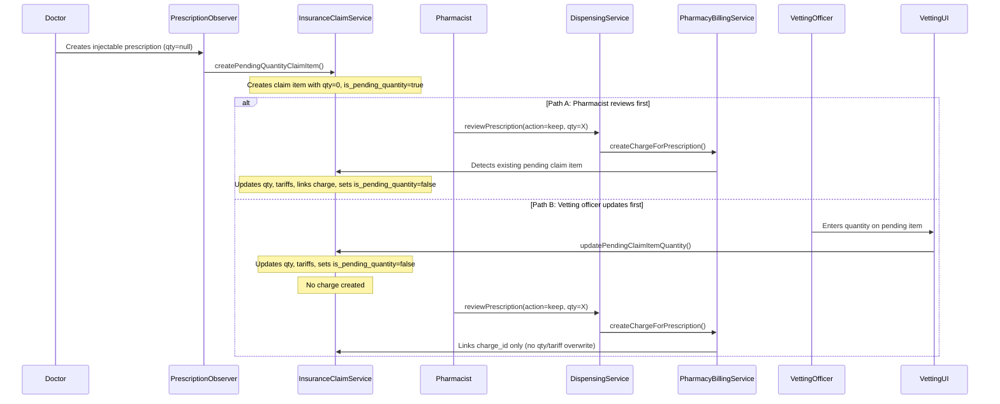

# Design Document: Injectable Claim Items

## Overview

This feature ensures that injectable/infusion prescriptions (where the doctor does not set a quantity) appear on insurance claims immediately at prescription time, rather than only after the pharmacist reviews them. A pending-quantity claim item is created with zero amounts when the prescription is created, then updated with actual financial data when either the pharmacist sets the quantity during dispensing review or the vetting officer manually enters it.

The core problem is an NHIS auditing gap: injectable prescriptions currently have no claim item until the pharmacist reviews them, which can lead to missing items on submitted claims. This design introduces a `is_pending_quantity` flag on `InsuranceClaimItem` and modifies three key touchpoints: prescription creation (observer), pharmacy review (dispensing service), and claim vetting (vetting UI + claim service).

## Architecture

The feature modifies existing components rather than introducing new ones. The flow follows two paths:



Key architectural decisions:

1. **Modify PrescriptionObserver** rather than creating a new event — the observer already handles the prescription creation lifecycle and claim linking for unpriced drugs. Adding pending-quantity logic here keeps the flow consistent.

2. **Detect-and-link pattern in PharmacyBillingService** — when `linkChargeToInsuranceClaim` runs, it checks for an existing pending claim item by drug code before creating a new one. This prevents duplicate claim items.

3. **Vetting officer has final authority** — if the vetting officer updates a claim item's quantity, subsequent pharmacist dispensing only links the charge without overwriting financial amounts. This is enforced by checking `is_pending_quantity` at link time.

## Components and Interfaces

### Modified Components

#### 1. PrescriptionObserver (`app/Observers/PrescriptionObserver.php`)

New method: `createPendingQuantityClaimItem(Prescription $prescription)`

Called from the `created()` hook when `$prescription->quantity === null` and the patient is insured. Creates a claim item with zero amounts and `is_pending_quantity = true`.

```php
// In created() method, new branch:
if ($prescription->drug_id && $prescription->quantity === null && $prescription->isPrescribed()) {
    $this->createPendingQuantityClaimItem($prescription);
    return; // Skip charge creation — no quantity means no charge yet
}
```

#### 2. InsuranceClaimService (`app/Services/InsuranceClaimService.php`)

New methods:

- `createPendingQuantityClaimItem(InsuranceClaim $claim, Prescription $prescription): InsuranceClaimItem` — creates a claim item with qty=0, all financial fields at 0, and `is_pending_quantity = true`.

- `updatePendingClaimItemQuantity(InsuranceClaimItem $item, int $quantity): InsuranceClaimItem` — sets the quantity, recalculates tariffs via `InsuranceService::calculateCoverage()`, sets `is_pending_quantity = false`, and recalculates claim totals.

- `findPendingClaimItemForPrescription(InsuranceClaim $claim, string $drugCode): ?InsuranceClaimItem` — finds an existing pending claim item by drug code on the claim.

#### 3. PharmacyBillingService (`app/Services/PharmacyBillingService.php`)

Modified method: `linkChargeToInsuranceClaim(Charge $charge, ?int $patientCheckinId)`

Before creating a new claim item via `addChargesToClaim`, check if a pending claim item already exists for this drug code. If found:
- If `is_pending_quantity = true`: update it with quantity, tariffs, link charge, set flag to false.
- If `is_pending_quantity = false` (vetting officer already resolved): link charge_id only, no financial overwrite.

#### 4. DispensingService (`app/Services/DispensingService.php`)

Modified method: `reviewPrescription()` — in the `keep` case, after setting the quantity on the prescription and creating the charge, the existing `createChargeForPrescription` call already triggers `linkChargeToInsuranceClaim` which will handle the pending claim item detection. No additional logic needed in DispensingService itself beyond what PharmacyBillingService handles.

#### 5. ClaimItemsTabs (`resources/js/components/Insurance/VettingModal/ClaimItemsTabs.tsx`)

Modified to:
- Highlight rows where `is_pending_quantity = true` with amber/yellow background.
- Show a "Pending Qty" badge next to the item description.
- Make the quantity field editable for pending items (it already is for non-disabled mode).
- On quantity change for a pending item, call the existing PATCH endpoint which will be enhanced to handle pending quantity resolution.

#### 6. ClaimItem Controller (`app/Http/Controllers/Insurance/ClaimItemController.php`)

Modified PATCH endpoint: when updating a claim item with `is_pending_quantity = true` and a quantity is provided, delegate to `InsuranceClaimService::updatePendingClaimItemQuantity()` to recalculate tariffs and resolve the pending state.

### Interface Contracts

```php
// InsuranceClaimService new methods
public function createPendingQuantityClaimItem(
    InsuranceClaim $claim,
    Prescription $prescription
): InsuranceClaimItem;

public function updatePendingClaimItemQuantity(
    InsuranceClaimItem $item,
    int $quantity
): InsuranceClaimItem;

public function findPendingClaimItemForPrescription(
    InsuranceClaim $claim,
    string $drugCode
): ?InsuranceClaimItem;
```

## Data Models

### Database Migration

Add `is_pending_quantity` boolean column to `insurance_claim_items` table:

```php
Schema::table('insurance_claim_items', function (Blueprint $table) {
    $table->boolean('is_pending_quantity')->default(false)->after('has_flexible_copay');
});
```

### InsuranceClaimItem Model Changes

Add to `$fillable`:
```php
'is_pending_quantity',
```

Add to `casts()`:
```php
'is_pending_quantity' => 'boolean',
```

### Pending Claim Item Shape

When created by the observer, a pending claim item looks like:

| Field | Value |
|-------|-------|
| `insurance_claim_id` | The patient's current claim ID |
| `charge_id` | `null` (no charge yet) |
| `item_date` | Prescription's `created_at` |
| `item_type` | `'drug'` |
| `code` | Drug's `drug_code` |
| `description` | `"{drug_name} (Pending quantity)"` |
| `quantity` | `0` |
| `unit_tariff` | `0.00` |
| `subtotal` | `0.00` |
| `is_covered` | `true` (assumed covered, recalculated on resolution) |
| `coverage_percentage` | `0.00` |
| `insurance_pays` | `0.00` |
| `patient_pays` | `0.00` |
| `is_pending_quantity` | `true` |
| `is_approved` | `null` |

### TypeScript Type Update

Add `is_pending_quantity` to the `ClaimItem` type in `resources/js/components/Insurance/VettingModal/types.ts`:

```typescript
interface ClaimItem {
    // ... existing fields
    is_pending_quantity: boolean;
}
```


## Correctness Properties

*A property is a characteristic or behavior that should hold true across all valid executions of a system — essentially, a formal statement about what the system should do. Properties serve as the bridge between human-readable specifications and machine-verifiable correctness guarantees.*

### Property 1: Pending claim item creation for injectable prescriptions

*For any* injectable prescription (quantity is null) created for an insured patient with an active insurance claim, the observer shall create exactly one claim item on that claim with `quantity = 0`, `insurance_pays = 0`, `patient_pays = 0`, `subtotal = 0`, `is_pending_quantity = true`, the drug's `drug_code` as `code`, `item_type = 'drug'`, and no associated billing charge.

**Validates: Requirements 1.1, 1.2, 1.4**

### Property 2: Non-injectable prescriptions follow existing workflow

*For any* prescription created with a non-null quantity for an insured patient, the observer shall create a billing charge and a claim item following the existing logic, with `is_pending_quantity = false` on the resulting claim item.

**Validates: Requirements 1.3, 7.1, 7.2**

### Property 3: Pharmacist review resolves pending claim item

*For any* injectable prescription with a pending claim item (`is_pending_quantity = true`), when the pharmacist reviews it with action "keep" and enters a quantity, the claim item shall be updated with the entered quantity, recalculated tariffs (unit_tariff, subtotal, insurance_pays, patient_pays), a linked charge_id, and `is_pending_quantity = false`.

**Validates: Requirements 3.1, 3.3**

### Property 4: Vetting officer priority — charge links without financial overwrite

*For any* injectable prescription whose claim item has already been resolved by the vetting officer (`is_pending_quantity = false`, `charge_id = null`), when the pharmacist subsequently reviews and creates a charge, the charge_id shall be linked to the claim item without modifying the quantity, unit_tariff, subtotal, insurance_pays, or patient_pays.

**Validates: Requirements 3.2, 5.1**

### Property 5: No duplicate claim items after pharmacist review

*For any* injectable prescription with an existing pending claim item on a claim, after the pharmacist reviews it with action "keep", the claim shall contain exactly one claim item for that drug code — not two.

**Validates: Requirements 3.4**

### Property 6: Vetting officer update resolves pending claim item without charge

*For any* pending claim item (`is_pending_quantity = true`), when the vetting officer sets a quantity, the claim item shall be updated with the new quantity, recalculated tariffs, `is_pending_quantity = false`, and no billing charge shall be created.

**Validates: Requirements 4.1, 4.2**

### Property 7: Claim totals equal sum of item amounts

*For any* insurance claim, after any claim item update (including pending quantity resolution), the claim's `total_claim_amount` shall equal the sum of all item `subtotal` values, `insurance_covered_amount` shall equal the sum of all item `insurance_pays` values, and `patient_copay_amount` shall equal the sum of all item `patient_pays` values.

**Validates: Requirements 4.3**

### Property 8: Vetting officer overrides pharmacist quantity

*For any* claim item that was previously resolved by the pharmacist (`is_pending_quantity = false`, `charge_id` is set), when the vetting officer subsequently updates the quantity, the claim item shall reflect the vetting officer's quantity and recalculated tariffs, because the vetting officer has final authority.

**Validates: Requirements 5.2**

## Error Handling

| Scenario | Handling |
|----------|----------|
| No insurance claim exists for the patient's check-in | `PrescriptionObserver` silently skips pending claim item creation (Requirement 1.5). No error raised. |
| Patient is not insured | Observer skips — no claim lookup attempted. Existing behavior unchanged. |
| Drug has no `drug_code` | Observer skips pending claim item creation. The item cannot be identified on the claim without a code. |
| Pending claim item not found during pharmacist review | `PharmacyBillingService` falls through to existing `addChargesToClaim` logic, creating a new claim item as before. This handles edge cases where the pending item was manually deleted. |
| Vetting officer enters quantity of 0 | Validation rejects — quantity must be >= 1 when resolving a pending item. |
| Vetting officer enters negative quantity | Validation rejects — quantity must be a positive integer. |
| Coverage calculation fails | Wrap in try-catch; log the error and leave the claim item in its current state. The vetting officer can retry. |
| Concurrent pharmacist and vetting officer updates | The `is_pending_quantity` flag acts as a guard. If the vetting officer resolves first (flag becomes false), the pharmacist's subsequent charge linking detects this and skips financial updates. Database-level row locking via Laravel's `DB::transaction` prevents race conditions. |

## Testing Strategy

### Dual Testing Approach

This feature requires both unit tests and property-based tests:

- **Unit tests** (Pest): Verify specific examples, edge cases (no claim exists, uninsured patient, drug without code), and integration between observer → service → model.
- **Property-based tests** (Pest with `pestphp/pest-plugin-faker` for data generation): Verify universal properties across randomized inputs — different drugs, quantities, insurance plans, and ordering of pharmacist vs. vetting officer actions.

### Property-Based Testing Configuration

- **Library**: Pest PHP with custom dataset generators (using `faker` and factory combinations to generate random valid inputs)
- **Minimum iterations**: 100 per property test
- **Tag format**: Each test tagged with `Feature: injectable-claim-items, Property {N}: {title}`

Each correctness property (1–8) maps to a single property-based test. The test generates random valid inputs (drugs, prescriptions, insurance plans, quantities) and asserts the property holds across all generated cases.

### Unit Test Coverage

- Observer creates pending claim item for injectable prescription (happy path example)
- Observer skips when no claim exists (edge case from Requirement 1.5)
- Observer skips for non-injectable prescriptions (regression)
- Pharmacist review updates pending claim item (happy path)
- Pharmacist review links charge only when vetting officer already resolved (priority path)
- Vetting officer resolves pending item via API endpoint
- Vetting officer quantity validation (rejects 0, negative, non-integer)
- Claim totals recalculated after pending item resolution
- Frontend renders "Pending Qty" badge for pending items (component test)

### Property-Based Test Summary

| Property | Test Description | Validates |
|----------|-----------------|-----------|
| P1 | Random injectable prescriptions create correct pending claim items | Req 1.1, 1.2, 1.4 |
| P2 | Random non-injectable prescriptions follow existing workflow | Req 1.3, 7.1, 7.2 |
| P3 | Random pharmacist reviews resolve pending items correctly | Req 3.1, 3.3 |
| P4 | Charge linking preserves vetting officer's financial amounts | Req 3.2, 5.1 |
| P5 | No duplicate claim items after pharmacist review | Req 3.4 |
| P6 | Vetting officer updates resolve pending items without charges | Req 4.1, 4.2 |
| P7 | Claim totals always equal sum of item amounts | Req 4.3 |
| P8 | Vetting officer can override pharmacist-set quantities | Req 5.2 |
