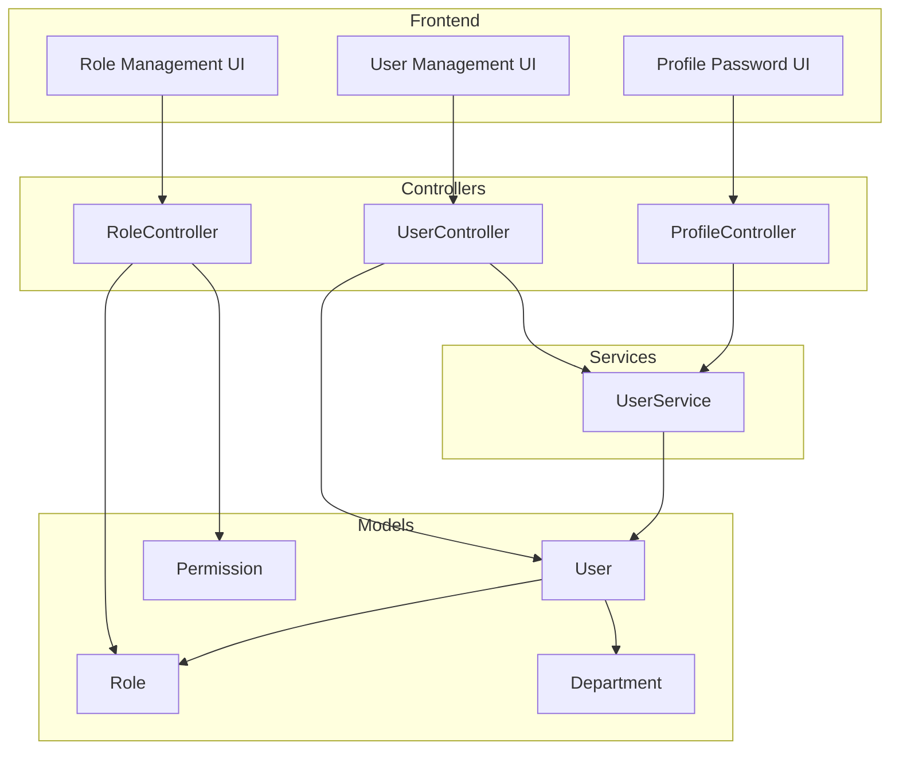

# Design Document: User Management

## Overview

This feature provides a comprehensive user management system for HMS administrators to manage staff accounts, roles, and department assignments. The design follows existing HMS patterns including policy-based authorization, Form Request validation, and Inertia.js frontend components.

Key design decisions:
- Password changes are self-service only (users change their own via profile)
- Admins can trigger password resets that generate temporary passwords
- Users with temporary passwords must change them on next login
- Account deactivation prevents login without deleting data
- Uses existing Spatie Permission package for roles/permissions

## Architecture

The feature follows the existing HMS domain-driven structure:

```
app/Http/Controllers/
└── Admin/
    ├── UserController.php           # User CRUD operations
    └── RoleController.php           # Role management

app/Http/Requests/Admin/
├── StoreUserRequest.php
├── UpdateUserRequest.php
├── StoreRoleRequest.php
└── UpdateRoleRequest.php

app/Policies/
├── UserPolicy.php
└── RolePolicy.php

app/Services/
└── UserService.php                  # Password generation, session management

resources/js/pages/Admin/
├── Users/
│   ├── Index.tsx                    # User list with search/filter
│   ├── Create.tsx                   # Create user form
│   └── Edit.tsx                     # Edit user form
├── Roles/
│   ├── Index.tsx                    # Role list
│   ├── Create.tsx                   # Create role form
│   └── Edit.tsx                     # Edit role form
└── Profile/
    └── Password.tsx                 # Self-service password change
```

### Component Diagram



## Components and Interfaces

### UserController

Handles all user CRUD operations for administrators.

```php
class UserController extends Controller
{
    public function index(Request $request): Response;      // List users with pagination
    public function create(): Response;                      // Show create form
    public function store(StoreUserRequest $request): RedirectResponse;
    public function edit(User $user): Response;              // Show edit form
    public function update(UpdateUserRequest $request, User $user): RedirectResponse;
    public function toggleActive(User $user): RedirectResponse;  // Activate/deactivate
    public function resetPassword(User $user): RedirectResponse; // Generate temp password
}
```

### RoleController

Manages roles and their permissions.

```php
class RoleController extends Controller
{
    public function index(): Response;                       // List roles
    public function create(): Response;                      // Show create form
    public function store(StoreRoleRequest $request): RedirectResponse;
    public function edit(Role $role): Response;              // Show edit form
    public function update(UpdateRoleRequest $request, Role $role): RedirectResponse;
    public function destroy(Role $role): RedirectResponse;   // Delete role (if no users)
}
```

### ProfileController (Password Change)

Handles self-service password changes.

```php
class ProfileController extends Controller
{
    public function showPasswordForm(): Response;
    public function updatePassword(UpdatePasswordRequest $request): RedirectResponse;
}
```

### UserService

Encapsulates user-related business logic.

```php
class UserService
{
    public function generateTemporaryPassword(): string;
    public function invalidateUserSessions(User $user): void;
    public function createUser(array $data): User;
    public function updateUser(User $user, array $data): User;
}
```

### UserPolicy

Authorization rules for user management.

```php
class UserPolicy
{
    public function viewAny(User $user): bool;      // users.view-all
    public function create(User $user): bool;       // users.create
    public function update(User $user, User $model): bool;  // users.update
    public function toggleActive(User $user, User $model): bool;  // users.update + not self
    public function resetPassword(User $user, User $model): bool; // users.reset-password
}
```

## Data Models

### User Model Updates

Add new fields to support account status and password reset flow:

```php
// New fillable fields
protected $fillable = [
    'name',
    'username',               // Unique alphanumeric identifier (min 4 chars)
    'password',
    'is_active',              // Account enabled/disabled
    'must_change_password',   // Force password change on login
];

// New casts
protected function casts(): array
{
    return [
        'password' => 'hashed',
        'is_active' => 'boolean',
        'must_change_password' => 'boolean',
    ];
}

// Scope for active users
public function scopeActive($query): void
{
    $query->where('is_active', true);
}
```

### Database Migration

```php
// Users table now uses username instead of email
Schema::create('users', function (Blueprint $table) {
    $table->id();
    $table->string('name');
    $table->string('username')->unique();  // Alphanumeric, min 4 chars
    $table->string('password');
    $table->boolean('is_active')->default(true);
    $table->boolean('must_change_password')->default(false);
    // ... other fields
});
```

### Existing Relationships (No Changes)

- `User` belongsToMany `Department` (via `department_user` pivot)
- `User` belongsToMany `Role` (via Spatie `model_has_roles`)
- `Role` belongsToMany `Permission` (via Spatie `role_has_permissions`)

## Correctness Properties

*A property is a characteristic or behavior that should hold true across all valid executions of a system-essentially, a formal statement about what the system should do. Properties serve as the bridge between human-readable specifications and machine-verifiable correctness guarantees.*

### Property 1: User creation assigns at least one role
*For any* user creation request with valid data, the created user SHALL have at least one role assigned in the database.
**Validates: Requirements 2.4**

### Property 2: Username uniqueness constraint
*For any* user creation or update request, if the username already exists for a different user, the system SHALL reject the request with a validation error.
**Validates: Requirements 2.3, 3.4**

### Property 3: Deactivated users cannot authenticate
*For any* user with `is_active = false`, authentication attempts SHALL fail regardless of correct credentials.
**Validates: Requirements 4.1, 4.4**

### Property 4: Self-deactivation prevention
*For any* deactivation request where the target user is the authenticated user, the system SHALL reject the request.
**Validates: Requirements 4.3**

### Property 5: Password change requires correct current password
*For any* password change request, if the provided current password does not match the user's stored password, the system SHALL reject the request.
**Validates: Requirements 5.3**

### Property 6: Password reset sets must_change_password flag
*For any* admin-triggered password reset, the target user's `must_change_password` flag SHALL be set to true.
**Validates: Requirements 7.3**

### Property 7: Role deletion blocked when users assigned
*For any* role deletion request, if the role has one or more users assigned, the system SHALL reject the deletion.
**Validates: Requirements 6.4**

### Property 8: Successful password change invalidates other sessions
*For any* successful password change (self-service or reset), all existing sessions for that user except the current one SHALL be invalidated.
**Validates: Requirements 5.5, 7.4**

## Error Handling

### Validation Errors

| Scenario | Error Message |
|----------|---------------|
| Duplicate username | "The username has already been taken." |
| Missing role | "At least one role must be assigned." |
| Invalid current password | "The current password is incorrect." |
| Weak password | "The password must be at least 8 characters and contain..." |
| Self-deactivation | "You cannot deactivate your own account." |
| Role has users | "Cannot delete role with X assigned users." |

### Authorization Errors

- 403 Forbidden for unauthorized access attempts
- Redirect to login for unauthenticated requests
- Redirect to password change page for users with `must_change_password = true`

### System Errors

- Database errors logged and generic error shown to user
- Session invalidation failures logged but don't block operation

## Testing Strategy

### Dual Testing Approach

This feature uses both unit tests and property-based tests:
- **Unit tests**: Verify specific examples, edge cases, and integration points
- **Property-based tests**: Verify universal properties hold across all inputs

### Property-Based Testing Library

Use **Pest** with **pest-plugin-faker** for property-based testing in PHP. Configure each property test to run a minimum of 100 iterations.

### Test Categories

#### Feature Tests (Primary)

```php
// tests/Feature/Admin/UserManagementTest.php
- it('lists users with pagination for admin')
- it('prevents non-admin from accessing user management')
- it('creates user with roles and departments')
- it('prevents duplicate email on create')
- it('requires at least one role on create')
- it('updates user without changing password')
- it('prevents duplicate email on update')
- it('deactivates user account')
- it('prevents self-deactivation')
- it('reactivates user account')
- it('resets user password and sets must_change_password flag')
- it('filters users by role')
- it('filters users by department')
- it('searches users by name or email')

// tests/Feature/Admin/RoleManagementTest.php
- it('lists roles with permission counts')
- it('creates role with permissions')
- it('updates role permissions')
- it('prevents deletion of role with assigned users')
- it('deletes role without assigned users')

// tests/Feature/Profile/PasswordChangeTest.php
- it('changes password with correct current password')
- it('rejects password change with incorrect current password')
- it('enforces password complexity requirements')
- it('invalidates other sessions after password change')
- it('redirects to password change when must_change_password is true')
```

#### Property-Based Tests

Each correctness property will be implemented as a property-based test with the following format:

```php
/**
 * **Feature: user-management, Property 1: User creation assigns at least one role**
 * **Validates: Requirements 2.4**
 */
it('always assigns at least one role to created users', function () {
    // Generate random valid user data with roles
    // Assert created user has >= 1 role
})->repeat(100);
```

#### Unit Tests

```php
// tests/Unit/Services/UserServiceTest.php
- it('generates secure temporary passwords')
- it('invalidates all user sessions')
```

### Test Data

Use factories for all test data:
- `User::factory()->admin()` - User with admin role
- `User::factory()->doctor()` - User with doctor role
- `User::factory()->inactive()` - Deactivated user
- `User::factory()->mustChangePassword()` - User requiring password change
